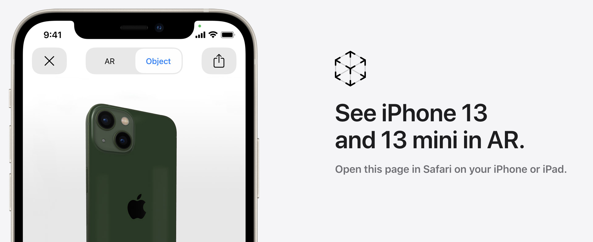
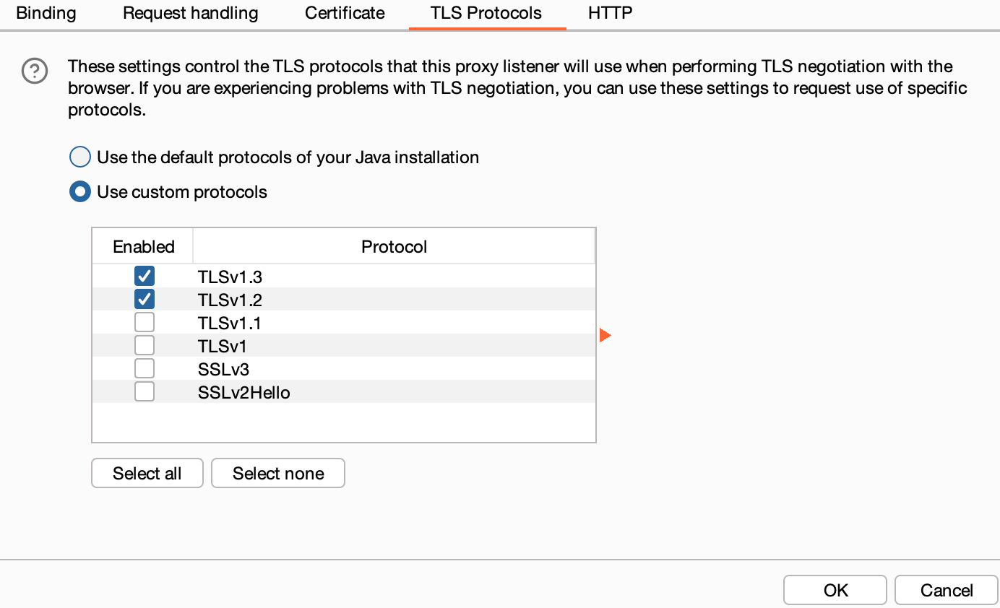
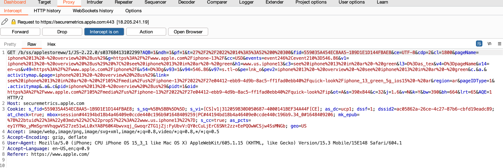
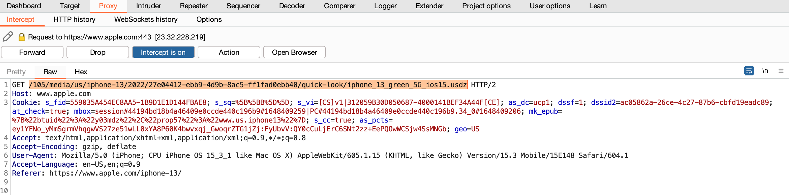
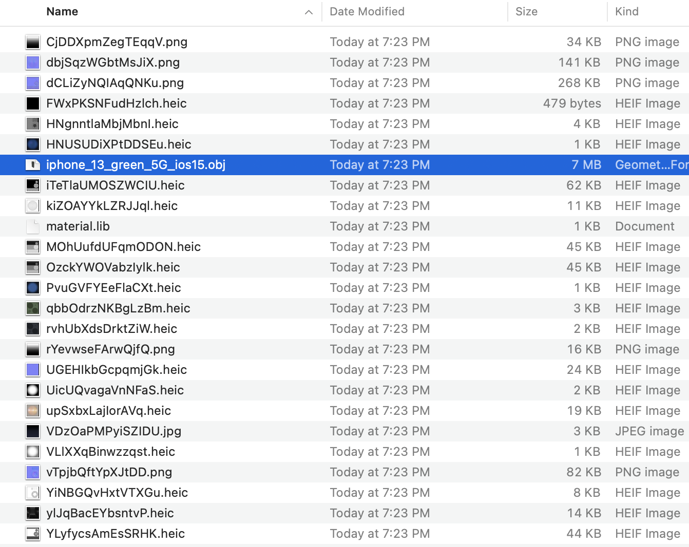
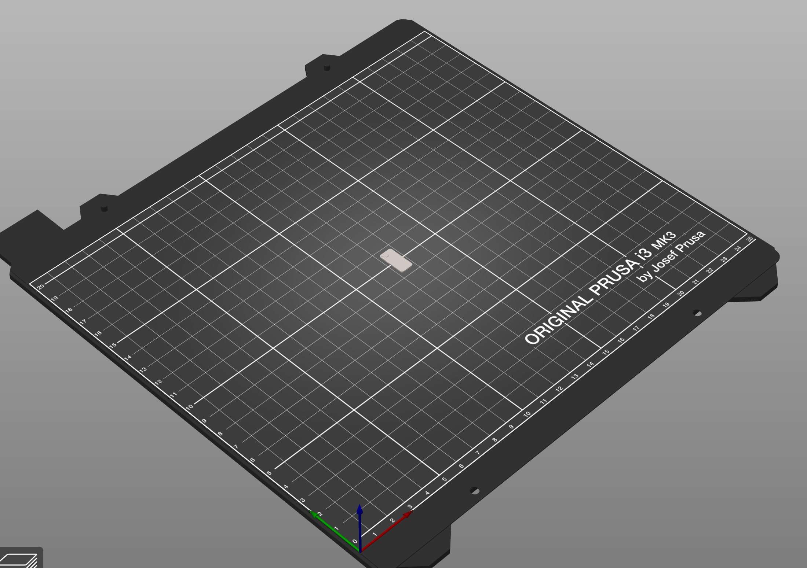
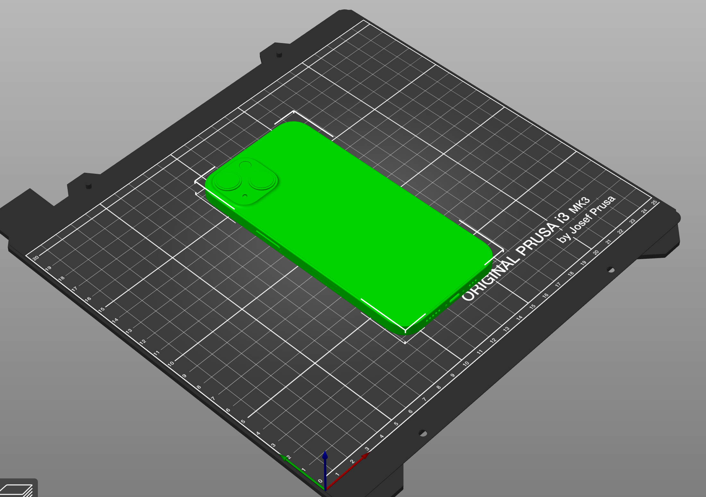

# Exporting Apple ARKit Models

## Intro

Since apple introduced their ARKit they have started uploading 3D models of their products to their website

I thought it would be interesting to see if I could export these files and 3D print them to see how accurate they are.

## Getting the File

One of the difficulties I faced is that this feature on the website only is available on iPhones and iPads:

This means that I can not simply monitor the traffic on my computer to access the file.

### Burp to the rescue

Since we need an iOS device to access this feature I configured my iPhone to connect to Burp via a proxy. I followed this [guide](https://portswigger.net/support/configuring-an-ios-device-to-work-with-burp) for the most part, the only change I had to make was forcing the proxy to not use TLSv1 or TLSv1.1 (it was causing errors accessing the apple website via https).

Once my iPhone was configured to use the Burp proxy I then navigated to the page on my iPhone and turned intercept on within Burp. After clicking the link I took a look at the requests the iPhone was sending:

First request doesn't isn't that interesting, let's just forward that one.

The second request seems to be getting a 'usdz' file. Seems promising. Let's download that file locally from the full path: <https://www.apple.com/105/media/us/iphone-13/2022/27e04412-ebb9-4d9b-8ac5-ff1fad0ebb40/quick-look/iphone_13_green_5G_ios15.usdz>

### USDZ file extension

A little bit of research reveals that a USDZ is just a zipped USD file (Universal Scene Descriptor). Ideally we would want to be able to convert to a  more standard STL or OBJ file for printing.

Looking around online it appears that it is possible to do via this [script](https://stackoverflow.com/a/58149122) found on stackoverflow. I ended up using an [online converter](https://products.aspose.app/3d/conversion/usdz-to-obj) that worked just as well.

The USDZ file contains a lot of goodies, but the file I am interested in is the OBJ

## Using the File

Now that we have the OBJ file we can open it in the slicer of our choosing. I used Prusaslicer.

Upon loading the file the model was clearly not at the right scale:

Looking at the model's dimensions and the reported dimensions of the phone online it looks to be 1/10th scale. Adjusting the scale of our model by 10 produces a more sensible result:

## UNDER CONSTRUCTION 🚧

Check back later for more updates!
